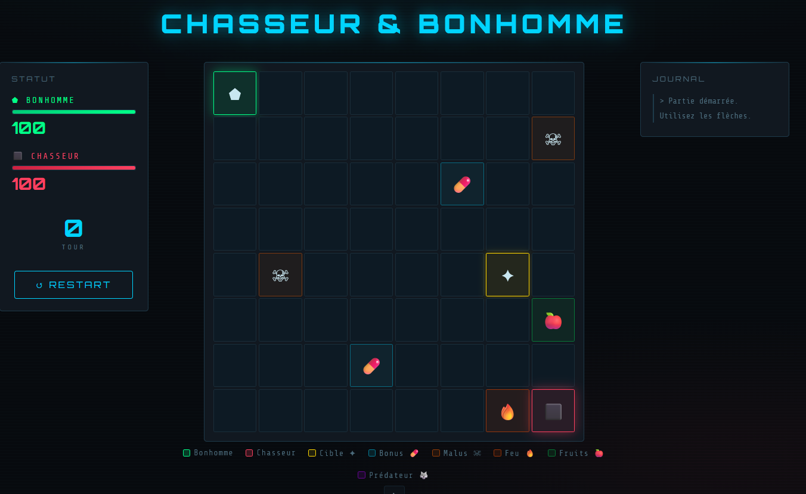
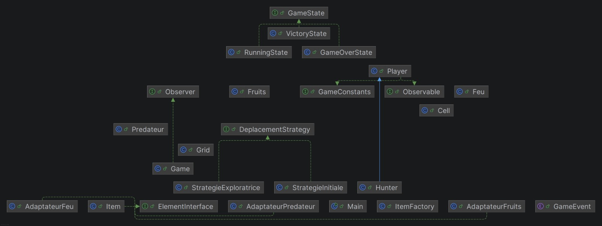

# Hunter & Player — Java Design Patterns Game

A two-player grid-based game built in Java, showcasing 6 design patterns.
The player is controlled via keyboard, the hunter moves automatically toward the target.



---

## Design Patterns Implemented

| Pattern    | Application                                                    |
|------------|----------------------------------------------------------------|
| Adapter    | Integrates external classes (Fire, Fruits, Predator) via `ElementInterface` |
| Strategy   | Player movement behavior switches based on energy level        |
| Observer   | Automatic game-over detection when player state changes        |
| Singleton  | Single instance of the game grid                               |
| Factory    | Centralized item creation (`ItemFactory`)                      |
| State      | End-of-game state management (Running, GameOver, Victory)      |

---

## Architecture

```
src/main/java/classique/          Game logic (patterns, rules, entities)
src/main/java/com/jeu/...         Spring Boot layer (REST controller, service, DTO)
src/main/resources/static/        Web interface (index.html)
```

---

## Requirements

- Java 21
- Maven (or use the included `mvnw.cmd` wrapper)

---

## Run the project

**Option 1 — Build and run the JAR**

```bash
mvnw.cmd clean package -DskipTests
java -jar target/chasseur-bonhomme-0.0.1-SNAPSHOT.jar
```

Then open your browser at: `http://localhost:8080`

**Option 2 — Use the prebuilt JAR**

```bash
java -jar chasseur-bonhomme-0.0.1-SNAPSHOT.jar
```

---

## How to play

- Use the **arrow keys** to move the player across the 8x8 grid
- The hunter moves automatically toward the hidden target each turn
- Each move costs 1 energy — collect bonus items to recover energy
- The player can only see cells within a radius of 3 (fog of war)
- The hunter is always visible

**Win condition** : reach the target before the hunter does  
**Lose condition** : run out of energy or get eliminated by the hunter

---

## UML Class Diagram


